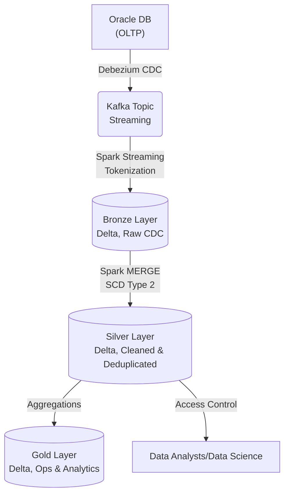

# Bonus Challenge: Data Lakehouse cho Hệ thống Gọi xe (Ride-hailing CDC)

**Họ và tên:** Phạm Lê Hoàng Nam  
**MSHV:** 2A202600416  
**Topic:** Vietnamese ride-hailing CDC → Lakehouse (Decree 13 compliant)

---

## 1. Problem Statement

Xây dựng pipeline CDC (Change Data Capture) từ Oracle DB vào Data Lakehouse phục vụ phân tích dữ liệu cho nền tảng gọi xe tại Việt Nam. Yêu cầu chịu tải tới **30K writes/sec** ở đỉnh điểm và khoảng 100 triệu chuyến xe/năm.

Thử thách lớn nhất là sự kết hợp giữa hiệu năng và pháp lý: Cần đảm bảo SLA nghiêm ngặt (dashboard cập nhật dưới 60s sau nguồn, truy vấn ad-hoc p95 < 1s), xử lý dữ liệu đến trễ do tài xế mất mạng, đồng thời tuân thủ gắt gao **Nghị định 13/2023/NĐ-CP** đối với dữ liệu PII (số điện thoại, căn cước, GPS).

---

## 2. Architecture Diagram

- **Bronze**: Lưu raw event, PII nhạy cảm đã bị mã hóa.
- **Silver**: Thông tin chuyến đi, tài xế, hành khách đã làm sạch, xử lý deduplication.
- **Gold**: Các bảng tổng hợp (ví dụ: `daily_revenue`, `active_drivers`).

---

## 3. Key Decisions & Rejected Alternatives

1. **Table Format: Chọn Delta Lake**
   - _Tôi chọn:_ **Delta Lake** vì khả năng MERGE ACID tốt cho dữ liệu CDC update thường xuyên.
   - _Tôi từ chối:_ **Apache Hudi** (mặc dù Hudi có MoR tốt cho streaming, nhưng cộng đồng hỗ trợ và tools ecosystem ở Việt Nam chưa quen thuộc bằng Delta). Tôi cũng từ chối **Apache Iceberg** do team đã có chuyên môn với quy trình Delta Lake hiện tại.

2. **Bảo mật PII (Nghị định 13): Tokenization ngay trước khi vào Bronze**
   - _Tôi chọn:_ Thực hiện Tokenize (mã hóa không thể dịch ngược hoặc có Vault key riêng) dữ liệu PII ngay tại bước đẩy vào Bronze.
   - _Tôi từ chối:_ Lưu plain-text ở Bronze và dùng View che ID ở Silver. Vì nếu lộ lọt hạ tầng S3 ở Bronze, công ty sẽ vi phạm luật nghiêm trọng.

3. **Cập nhật dữ liệu trễ (Late-arriving data): MERGE với Time Condition**
   - _Tôi chọn:_ Cập nhật bảng Silver bằng `MERGE WHEN MATCHED AND src.ts > tgt.ts THEN UPDATE`.
   - _Tôi từ chối:_ Phương pháp Append-only và làm Window Functions (để lấy bản ghi mới nhất) ở lúc Read. Cách này giúp ghi nhanh nhưng phá hỏng mục tiêu "P95 < 1s" khi analyst query ở Silver/Gold do chi phí tính toán cao.

4. **Xử lý File Nhỏ (Small File Problem): OPTIMIZE Z-ORDER định kỳ**
   - _Tôi chọn:_ Auto-compaction trên stream với dung lượng file target ngắn hạn (128MB), và chạy job `OPTIMIZE Z-ORDER BY (driver_id, trip_date)` vào lúc 3h sáng để tối ưu cho query tra cứu của Analyst.
   - _Tôi từ chối:_ Việc OPTIMIZE liên tục sau mỗi micro-batch (tốn kém compute vô ích do file thay đổi liên tục).

5. **Streaming vs Batch: Spark Structured Streaming (Micro-batch 30s)**
   - _Tôi chọn:_ Micro-batch mỗi 30s từ Kafka vào Bronze để đáp ứng SLA Dashboard 60s.
   - _Tôi từ chối:_ **Flink** (tăng độ phức tạp vận hành lên quá cao trong khi Spark đã đủ đáp ứng 30s latency).

---

## 4. Failure Modes (Kịch bản sự cố)

1. **Lỗi logic pipeline làm hỏng dữ liệu báo cáo doanh thu:**
   - _Phát hiện:_ Data quality tests (Silver) ghi nhận tổng doanh thu âm bất thường.
   - _Rollback:_ Sử dụng tính năng **Time Travel** của Delta Lake, gọi câu lệnh `RESTORE TABLE gold.daily_revenue TO TIMESTAMP AS OF '2026-05-04 02:00:00'` để lập tức khôi phục trạng thái đúng cách đó vài giờ, song song với việc fix bug pipeline.

2. **Nguồn dữ liệu đổi định dạng Log GPS đột ngột:**
   - _Phát hiện:_ CDC pipe break do column mới.
   - _Rollback:_ Bật chế độ **Schema Evolution** (`schema_mode="merge"`) để chấp nhận thêm column linh động cho các thay đổi Data Contract không quá nghiêm trọng ở Bronze layer.

3. **Xóa nhầm khách hàng (Yêu cầu Quyền được lãng quên - Right to be forgotten):**
   - _Xử lý:_ Do hệ thống sử dụng Lakehouse có ACID, tôi có thể chạy `DELETE FROM silver.users WHERE user_id = 'XYZ'`. Tuy nhiên, vì Delta giữ lại history (Time Travel), tôi sẽ cấu hình `VACUUM` với retention thấp cho khu vực PII để xóa hẳn tệp vật lý sau 7 ngày, đảm bảo xóa tận gốc theo luật.

---

## 5. Cost Back-of-Envelope (Dự toán chi phí)

- **Storage:** 100M trips/năm. Giả định trung bình 1 event = 3KB. Tổng storage thô: ~300GB/năm. Thêm Bronze, Silver, Gold và history logs ~ x5 = 1.5 TB.
  - Chi phí S3 Standard: $23 / TB / tháng. $\Rightarrow$ Storage cost $\approx \$35$/tháng -> Rất rẻ.
- **Compute (Mắc nhất):**
  - Stream Ingestion (chạy 24/7): 2 Nodes (ví dụ: m5.xlarge) $\approx \$150$/node/tháng $\Rightarrow \$300$.
  - Batch Daily Optimize/Aggregations: 4 Nodes chạy 2 giờ/ngày $\approx \$50$/tháng.
- **Total TCO ước tính:** **~ $385 / tháng**. Phù hợp với ngân sách hệ thống Data cho một doanh nghiệp SME/Platform.

---

## 6. MVP Slice (Khởi tạo tuần đầu)

Để chứng minh tính khả thi, MVP 1 tuần đầu sẽ không setup Kafka hay DB thật mà:

1. Dùng script Python sinh giả lập (`generate_data_lite`) dòng event CDC JSON (gồm số điện thoại, trip_id).
2. Xây logic **Tokenization PII** băm số điện thoại lúc ghi vào thư mục Bronze.
3. Viết 1 Notebook DuckDB/Delta thực hiện **MERGE** vào Silver để minh chứng việc handle _Late-arriving data_ (cùng `trip_id` update trạng thái hoàn thành).
4. Xác minh Query SLA và data trong Delta format có history.

---
